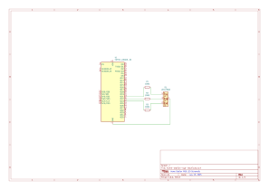

# Home Weather Station

In this project, we will build a simple home weather station using the ESP32 microcontroller and DHT11 temperature and humidity sensor. This project will allow you to monitor the temperature and humidity in your home and display the data on a web page. We will also have a simple web server with a simple interface that will allows us to update the firmware over the air (OTA).

## Components Required

- ESP32 development board
- DHT11 temperature and humidity sensor
- Jumper wires
- Breadboard (optional)
- USB cable for programming the ESP32

## Part 1: RGB LED Control

### Wiring Diagram



### Code 

1. `rgb_led.h`

   - This header containds the definitions for the RGB LED GPIO pins and the channel number.

   ```c
   // RGB LED GPIOs
    #define RGB_LED_RED_GPIO 21
    #define RGB_LED_GREEN_GPIO 22
    #define RGB_LED_BLUE_GPIO 23

    // RGB LED color mix channel
    #define RGB_LED_CHANNEL_NUM 3
   ```

   - This header also contains the structure definition for the RGB LED configuration.

   ```c
   // RGB LED configuration
   typedef struct 
   {
    int channel;
    int gpio;
    int mode;
    int timer_index;
   } ledc_info_t;
   ```

   - This header contains prototypes for the functions to initialize the RGB LED and set its color.

   ```c
    /**
    * Color to indicate WiFi application has started.
    */
    void rgb_led_wifi_app_started(void);

    /**

### Function Reference (`rgb_led.c` and `rgb_led.h`)

- **rgb_led_pmw_init(void):**
  Static. Initializes the LEDC timer and all RGB channels for PWM output. Called automatically by the public status functions if not already initialized.

- **rgb_led_set_color(uint8_t red, uint8_t green, uint8_t blue):**
  Static. Sets the PWM duty cycle for each color channel, mixing the desired color. Used internally by the status indication functions.

- **rgb_led_wifi_app_started(void):**
  Public. Sets the LED to a color (e.g., purple) to indicate the WiFi application has started.

- **rgb_led_http_server_started(void):**
  Public. Sets the LED to a color (e.g., orange) to indicate the HTTP server has started.

- **rgb_led_wifi_connected(void):**
  Public. Sets the LED to a color (e.g., green) to indicate a successful WiFi connection.
    * Color to indicate HTTP server has started.
    */
    void rgb_led_http_server_started(void);

    /**
    * Color to indicate that the EPS32 is connected to an access point.
    */
    void rgb_led_wifi_connected(void);
    ```

2. `rgb_led.c`

    - The source file containts all definitions for the functions declared in `rgb_led.h` as well as additional static functions to support configure and initialize the RGB using the ESP32 API.

    ```c
    #include <stdbool.h>

    #include "driver/ledc.h"
    #include "hal/ledc_types.h"
    #include "rgb_led.h"

    // RGB LED Info array
    ledc_info_t ledc_ch[RGB_LED_CHANNEL_NUM];

    // Handle for RGB LED PMW Init
    bool g_pmw_init_handle = false;

    /**
     * Initializes the RGB LED settings per channel, including
     * the GPIO for each color, mode and timer configuration
     */
    static void rgb_led_pmw_init(void) 
    {
        int rgb_ch;

        // Red
        ledc_ch[0].channel          = LEDC_CHANNEL_0;
        ledc_ch[0].gpio             = RGB_LED_RED_GPIO;
        ledc_ch[0].mode             = LEDC_HIGH_SPEED_MODE;
        ledc_ch[0].timer_index     = LEDC_TIMER_0;

        // Green
        ledc_ch[1].channel          = LEDC_CHANNEL_1;
        ledc_ch[1].gpio             = RGB_LED_GREEN_GPIO;
        ledc_ch[1].mode             = LEDC_HIGH_SPEED_MODE;
        ledc_ch[1].timer_index     = LEDC_TIMER_0;

        // Blue
        ledc_ch[2].channel          = LEDC_CHANNEL_2;
        ledc_ch[2].gpio             = RGB_LED_GREEN_GPIO;
        ledc_ch[2].mode             = LEDC_HIGH_SPEED_MODE;
        ledc_ch[2].timer_index     = LEDC_TIMER_0;

        // Configure timer 0
        ledc_timer_config_t ledc_timer =
        {
            .duty_resolution        = LEDC_TIMER_8_BIT,
            .freq_hz                = 100,
            .speed_mode             = LEDC_HIGH_SPEED_MODE,
            .timer_num              = LEDC_TIMER_0
        };
        ledc_timer_config(&ledc_timer);

        // Configure channels
        for (rgb_ch = 0; rgb_ch < RGB_LED_CHANNEL_NUM; rgb_ch++)
        {
            ledc_channel_config_t ledc_channel =
            {
                .channel            = ledc_ch[rgb_ch].channel,
                .duty               = 0,
                .hpoint             = 0,
                .gpio_num           = ledc_ch[rgb_ch].gpio,
                .intr_type          = LEDC_INTR_DISABLE,
                .speed_mode         = ledc_ch[rgb_ch].mode,
            };
            ledc_channel_config(&ledc_channel);
        }
        g_pmw_init_handle = true;
    }


    /**
     * Sets the RGB color.
     */
    static void rgb_led_set_color(uint8_t red, uint8_t green, uint8_t blue)
    {
        // Value should be 0-255 for an 8-bit number
        ledc_set_duty(ledc_ch[0].mode, ledc_ch[0].channel, red);
        ledc_update_duty(ledc_ch[0].mode, ledc_ch[0].channel);

        ledc_set_duty(ledc_ch[1].mode, ledc_ch[1].channel, green);
        ledc_update_duty(ledc_ch[1].mode, ledc_ch[1].channel);

        ledc_set_duty(ledc_ch[2].mode, ledc_ch[2].channel, blue);
        ledc_update_duty(ledc_ch[2].mode, ledc_ch[2].channel);
    }


    void rgb_led_wifi_app_started(void)
    {
        if (g_pmw_init_handle == false)
        {
            rgb_led_pmw_init();
        }
        
        rgb_led_set_color(255, 102, 255);
    }


    void rgb_led_http_server_started(void)
    {
        if (g_pmw_init_handle == false)
        {
            rgb_led_pmw_init();
        }
        
        rgb_led_set_color(204 , 102, 51);
    }


    void rgb_led_wifi_connected(void)
    {
        if (g_pmw_init_handle == false)
        {
            rgb_led_pmw_init();
        }
        
        rgb_led_set_color(0, 255, 153);
    }
    ```

## Part 2: WiFi - SoftAp

## `rgb_led.c` and `rgb_led.h` - RGB LED Control Logic

These files implement the RGB LED control logic, providing functions to initialize the LED hardware and set its color to indicate different system/application states. The implementation uses the ESP32's LEDC (LED Controller) peripheral for PWM-based color mixing.

### Key Features

  - Defines a configuration structure (`ledc_info_t`) for each color channel (red, green, blue), including channel, GPIO, mode, and timer index.
  - Uses macros to specify the GPIO pins and number of channels for the RGB LED.

  - The static function `rgb_led_pmw_init()` sets up the LEDC timer and configures each color channel for PWM output. It ensures the timer and channels are only initialized once per boot.

  - The static function `rgb_led_set_color(uint8_t red, uint8_t green, uint8_t blue)` sets the duty cycle for each color channel, allowing for 8-bit color mixing (0-255 per channel).

  - `rgb_led_wifi_app_started()`: Sets the LED to a specific color to indicate the WiFi application has started.
  - `rgb_led_http_server_started()`: Sets the LED to a different color to indicate the HTTP server has started.
  - `rgb_led_wifi_connected()`: Sets the LED to another color to indicate a successful WiFi connection.
  - Each of these functions ensures the LED is initialized before setting the color.

### Design Notes

- The use of static functions for initialization and color setting ensures encapsulation and prevents accidental re-initialization or misuse.
- The color values for each status are chosen for clear visual distinction and can be customized as needed.
- The header file (`rgb_led.h`) provides only the public API for status indication, hiding the lower-level details from other modules.

Refer to the source code in `main/rgb_led.c` and `main/rgb_led.h` for further details and implementation specifics.

During this part, we implement the WiFi SoftAP functionality to allow the ESP32 to create a WiFi access point. The implmentation also included the ability to manage WiFi and other tasks using FreeRTOS. Here are the key files and their contents:

## `wifi_app.c` - WiFi Application Logic

The `wifi_app.c` file contains the main logic for initializing, configuring, and managing the WiFi application on the ESP32. It handles WiFi and IP events, manages the FreeRTOS task and message queue for WiFi operations, and controls the RGB LED to indicate system status. Below is an overview of its structure and functionality:

### Key Features

### Function Reference (`wifi_app.c`)

- **wifi_app_event_handler(void *arg, esp_event_base_t event_base, int32_t event_id, void *event_data):**
  Handles WiFi and IP events. Logs event types such as AP start/stop, station connect/disconnect, and IP acquisition. Can be extended to trigger additional actions (e.g., LED updates or queue messages) based on event type.

- **wifi_app_event_handler_init():**
  Registers the event handler for both WiFi and IP events using ESP-IDF's event system. Ensures all relevant events are captured and processed by the application.

- **wifi_app_default_wifi_init():**
  Initializes the TCP/IP stack and configures the default WiFi settings. Creates network interfaces for both station and access point modes, preparing the ESP32 for dual-mode operation.

- **wifi_app_soft_ap_config():**
  Configures the ESP32 as a WiFi SoftAP (Access Point). Sets up the SSID, password, channel, visibility, authentication mode, and beacon interval. Assigns a static IP, gateway, and netmask, and starts the DHCP server for client devices.

- **wifi_app_task(void *pvParameters):**
  The main FreeRTOS task for the WiFi application. Initializes event handling, network stack, and SoftAP configuration, then starts the WiFi driver. Sends an initial message to start the HTTP server. Enters a loop to process messages from the queue, handling events such as HTTP server start, connection attempts, and successful connections (with corresponding LED updates).

- **wifi_app_send_message(wifi_app_message_e msgID):**
  Sends a message to the WiFi application's FreeRTOS queue. Used for asynchronous, event-driven communication between different parts of the application (e.g., from event handlers to the main task).

- **wifi_app_start():**
  Entry point for starting the WiFi application. Sets the initial LED color, disables default WiFi logging, creates the message queue, and starts the main WiFi application task pinned to a specific core.

  - Implements a static event handler (`wifi_app_event_handler`) for WiFi and IP events, such as AP start/stop, station connect/disconnect, and IP acquisition.
  - Logs each event and can trigger actions (e.g., LED color changes) based on the event type.

- **Initialization Functions:**
  - `wifi_app_event_handler_init()`: Registers the event handler for WiFi and IP events.
  - `wifi_app_default_wifi_init()`: Initializes the TCP/IP stack and configures the default WiFi settings, including creating network interfaces for both station and access point modes.
  - `wifi_app_soft_ap_config()`: Configures the ESP32 as a WiFi SoftAP, sets static IP, gateway, and netmask, and starts the DHCP server for clients.

- **Task and Queue Management:**
  - Defines a FreeRTOS task (`wifi_app_task`) that initializes the WiFi system, starts the WiFi driver, and processes messages from a queue to handle application-level events.
  - Uses a message queue (`wifi_app_queue_handle`) to communicate between different parts of the application, allowing asynchronous event handling.

- **LED Status Indication:**
  - Calls functions from `rgb_led.c` to set the RGB LED color based on the current WiFi application state (e.g., app started, HTTP server started, WiFi connected).

- **Public API:**
  - `wifi_app_send_message()`: Sends messages to the WiFi application queue for event-driven processing.
  - `wifi_app_start()`: Initializes the application, sets up the LED, disables default WiFi logging, creates the message queue, and starts the main WiFi application task.

### Example Flow

1. **Startup:** `wifi_app_start()` is called, which sets the initial LED color, disables verbose WiFi logs, creates the message queue, and starts the main task.
2. **Task Execution:** The main task (`wifi_app_task`) initializes the event handler, network stack, and SoftAP configuration, then starts the WiFi driver.
3. **Event Handling:** As WiFi and IP events occur, the registered event handler logs them and can trigger further actions (e.g., sending messages to the queue).
4. **Queue Processing:** The main task waits for messages (such as starting the HTTP server or indicating a successful connection) and updates the LED or performs other actions accordingly.

This modular approach allows for easy expansion of WiFi-related features and robust event-driven management of the ESP32's networking capabilities.

### Function Reference (`wifi_app.c`)

- **wifi_app_event_handler(void *arg, esp_event_base_t event_base, int32_t event_id, void *event_data):**
  Handles WiFi and IP events. Logs event types such as AP start/stop, station connect/disconnect, and IP acquisition. Can be extended to trigger additional actions (e.g., LED updates or queue messages) based on event type.

- **wifi_app_event_handler_init():**
  Registers the event handler for both WiFi and IP events using ESP-IDF's event system. Ensures all relevant events are captured and processed by the application.

- **wifi_app_default_wifi_init():**
  Initializes the TCP/IP stack and configures the default WiFi settings. Creates network interfaces for both station and access point modes, preparing the ESP32 for dual-mode operation.

- **wifi_app_soft_ap_config():**
  Configures the ESP32 as a WiFi SoftAP (Access Point). Sets up the SSID, password, channel, visibility, authentication mode, and beacon interval. Assigns a static IP, gateway, and netmask, and starts the DHCP server for client devices.

- **wifi_app_task(void *pvParameters):**
  The main FreeRTOS task for the WiFi application. Initializes event handling, network stack, and SoftAP configuration, then starts the WiFi driver. Sends an initial message to start the HTTP server. Enters a loop to process messages from the queue, handling events such as HTTP server start, connection attempts, and successful connections (with corresponding LED updates).

- **wifi_app_send_message(wifi_app_message_e msgID):**
  Sends a message to the WiFi application's FreeRTOS queue. Used for asynchronous, event-driven communication between different parts of the application (e.g., from event handlers to the main task).

- **wifi_app_start():**
  Entry point for starting the WiFi application. Sets the initial LED color, disables default WiFi logging, creates the message queue, and starts the main WiFi application task pinned to a specific core.

### Design Notes

- The use of FreeRTOS tasks and queues allows for responsive, event-driven application logic, making it easy to expand with new features (such as OTA updates or web server endpoints).
- The modular structure separates event handling, initialization, and application logic, improving maintainability and clarity.
- LED status indication provides immediate visual feedback for key application states, aiding in debugging and user experience.

Refer to the source code in `main/wifi_app.c` for further details and implementation specifics.

1. `tasks_common.h`

   - This header file contains common definitions for the FreeRTOS tasks, including stack size, priority, and core ID for the WiFi application task.

   ```c
   #ifndef MAIN_TASKS_COMMON_H_
   #define MAIN_TASKS_COMMON_H_

   // WiFi application task
   #define WIFI_APP_TASK_STACK_SIZE            4096
   #define WIFI_APP_TASK_PRIORITY              5
   #define WIFI_APP_TASK_CORE_ID               0

   #endif /* MAIN_TASKS_COMMON_H_ */
   ```

2. `wifi_app.h`

    - This header file defines the WiFi application settings
    ```c
    // WiFi application settings
    #define WIFI_AP_SSID                "ESP32"             // AP name
    #define WIFI_AP_PASSWORD            "password"          // AP password
    #define WIFI_AP_CHANNEL             1                   // AP channe;
    #define WIFI_AP_SSID_HIDDEN         0                   // AP visibility
    #define WIFI_AP_MAX_CONNECTIONS     5                   // AP max connections
    #define WIFI_AP_BEACON_INTERVAL     100                 // AP beacon: 100ms as recommend
    #define WIFI_AP_IP                  "192.168.0.1"       // AP default ip
    #define WIFI_AP_GATEWAY             "192.168.0.1"       // AP default gatewate (should be the same as the IP)
    #define WIFI_AP_NETMASK             "255.255.2255.0"    // AP netmask
    #define WIFI_AP_BANDWIDTH           WIFI_BW_HT20        // AP bandwidth 20 MHz (other option is 40 MHz) 
    #define WIFI_STA_POWER_SAVE         WIFI_PS_NONE        // Power save is not used
    #define MAX_SSID_LENGTH             32                  // IEEE stadard maximum
    #define MAX_PASSWORD_LENGTH         64                  // IEEE stadard maximum
    #define MAX_CONNECTION_RETRIES      5                   // Retry number on disconnect
    ```

    - The header file also contains the function prototypes for initializing the WiFi application and handling WiFi events.

    ```c
    /**
     * Sends a message to the queque
    * @param msgID message ID from the wifi_app_message_e enum.
    * @return pdTRUE if an item was succesfully sent to the queue, otherwise pdFALSE.
    * @note Expand the parameter list based on  your requiredments e.g. how you've expanded the wifi_app_queue_message_t
    */
    BaseType_t wifi_app_send_message(wifi_app_message_e msgID);

    /**
    * Starts the WiFi RROS task
    */
    void wifi_app_start(void);
    ```

    - We also define an enum for the WiFi application messages that can be sent to the queue.

    ```c
    /**
    * Message IDs fot the WiFi application task
    * @note Expand this based on thee application requirements
    */
    typedef enum wifi_app_message
    {
        WIFI_APP_MSG_START_HTTP_SERVER = 0,
        WIFI_APP_MSG_CONNECTING_FROM_HTTP_SERVER,
        WIFI_APP_MSG_STA_CONNECTED_GOT_IP,

    } wifi_app_message_e;

    /**
    * Structure for the message queque
    * @note Expand this based on the application requirements e.g. add another type and parameters as required
    */
    typedef struct  wifi_app_queue_message
    {
        wifi_app_message_e msgID;
    } wifi_app_queue_message_t;
    ``` 


   
